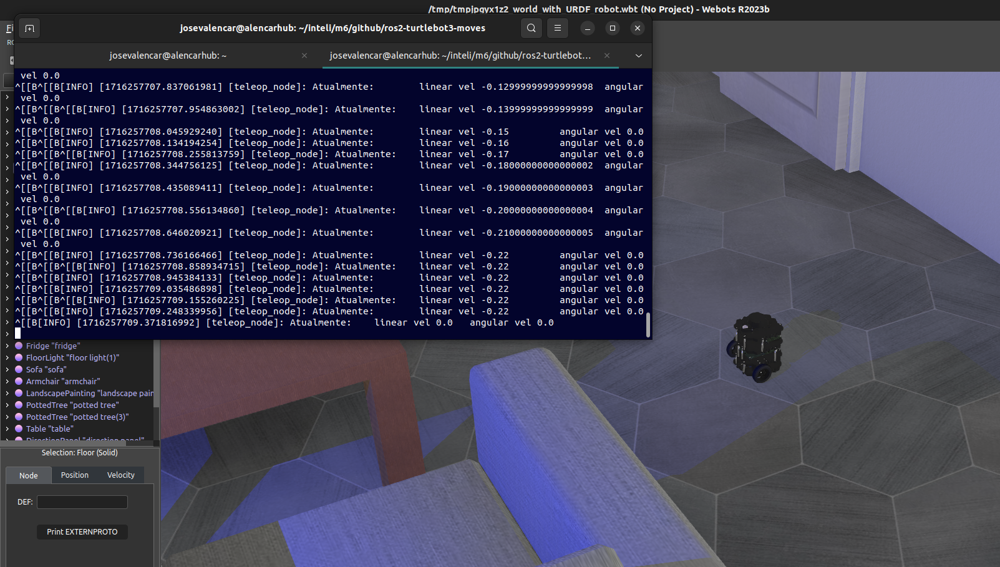

# Zeturguita: O Retorno

Este repositório possui um script apenas capaz de movimentar o robô turtlebot3 via terminal, com publishers, tópicos e serviços adequados para tal teleoperação.



# Contexto
## Requisitos 

O script cumpre dois requisitos principais: 
* **Interface de usuário**: A interface permite ao usuário comandar o robô por botões, exibe o status do robô em tempo real e oferece a funcionalidade de parada por botão de emergência.
* **Nó ROS 2**: Além da funcionalidade básica de controle e monitoramento de velocidade, o nó ainda conta com um serviço de ROS que é responsável por parar o robô e matar o processo de operação. Deve-se criar o cliente e o servidor para esse serviço.

## Features 

Tendo em vista os requisitos mencionados, o script realiza o seguinte: 
* **Movimentação por teclas do teclado**: achei pertinente sair do convencional a,w,s,d e mudar para as teclas arrow up, down, left, right. 
```bash
Teclas para se mover:
    ↑
←       →
    ↓

↑ : aumenta a velocidade linear (~ 0.22)

↓ : diminui a velocidade linear (~ 0.22)

← : aumenta velocidade angular (~ 2.84)

→ : diminui velocidade angular (~ 2.84)

Tecla de espaço: força a pausa

Pressione S para encerrar
```

* Informação da velocidade em tempo real: 
```bash
[INFO] [1716250787.343326078] [teleop_node]: Atualmente:	linear vel 0.0	 angular vel -0.02
```
* Método para controlar velocidade
* Método para suavizar velocidade

## Explicação

Antes de tudo, as seguintes bibliotecas são adicionadas, para controle do ROS em python assim como para estabelecer os serviços e envios das mensagens. Também, são criadas variáveis para controlar o valor máximo da velocidade do turtlebot e o incremento a cada iteração. 

```python
import rclpy
from rclpy.node import Node
from geometry_msgs.msg import Twist
import sys, select, tty, termios
from std_srvs.srv import Empty

VEL_LIN_MAX = 0.22
VEL_ANG_MAX = 2.84
VEL_LIN_INCREMENTO = 0.01
VEL_ANG_INCREMENTO = 0.1
```

### Nó ROS 2

Primeiro é criado um nó do ROS 2. Esse nó serve para fazermos ações com ele. Neste caso, também criamos um *publisher*. ELe serve para enviarmos informações para o Turtlebot3. Este publisher está configurado para enviar uma mensagem 'cmd_vel' do tipo Twist, com um histório de 10 mensagens na fila. 

Além disso, criamos 4 variáveis importantes para o projeto. Variáveis de alvo e de controle, tanto para o movimento linear quanto angular. A de alvo é a que o usuário determina conforme pressiona a tecla enquanto a de controle é a que estamos ajustando para controlar a velocidade. 

Nesta classe também é estebelcido um timer para ficar atualizando a função update a cada 0.1 segundo, assim também como cria um serviço para parar o robô. Quando um cliente requisita esse serviço, a função calback_parar_robo() é acionada, encerrando as comunicações. 


```python
class TeleopNode(Node):
    def __init__(self):
        super().__init__('teleop_node')
        self.publisher = self.create_publisher(Twist, 'cmd_vel', 10)
        self.vel_linear_alvo = 0.0
        self.vel_angular_alvo = 0.0
        self.vel_linear_controle = 0.0
        self.vel_angular_controle = 0.0
        self.settings = termios.tcgetattr(sys.stdin) # variável para salvar e restaurar as configurações do terminal
        self.get_logger().info(msg) # função para enviar a mensagem de inicialização declarada
        self.timer = self.create_timer(0.1, self.update)
        self.srv = self.create_service(Empty, 'parar_robo', self.callback_parar_robo)

    def callback_parar_robo(self, request, response):
        self.vel_linear_alvo = 0.0
        self.vel_angular_alvo = 0.0
        self.vel_linear_controle = 0.0
        self.vel_angular_controle = 0.0
        self.publisher.publish(Twist())  # Publicar Twist com velocidades zero
        self.get_logger().info('Serviço de parada do robô acionado, encerrando...')
        self.shutdown()
        return response
    
    def shutdown(self):
        rclpy.shutdown()
        termios.tcsetattr(sys.stdin, termios.TCSADRAIN, self.settings)
```
### Funções auxiliares

#### Get Key
A função getKey lê a entrada do teclado em modo raw, permitindo a captura de teclas especiais como as setas de direção. Isso é essencial para que o usuário possa controlar o robô em tempo real usando o teclado.

```python
def getKey(settings):
    tty.setraw(sys.stdin.fileno())
    rlist, _, _ = select.select([sys.stdin], [], [], 0.1)
    if rlist:
        key = sys.stdin.read(1)
        if key == '\x1b':
            key += sys.stdin.read(2)  # Read the next two characters
    else:
        key = ''
    termios.tcsetattr(sys.stdin, termios.TCSADRAIN, settings)
    return key
```
#### Suaviza Velocidade
Essa função ajusta suavemente a velocidade atual do robô para a velocidade alvo desejada. Isso ajuda a evitar mudanças bruscas na velocidade, proporcionando um movimento mais estável e controlado.

```python
def suavizarVelocidade(output, input, slop):
    if input > output:
        output = min(input, output + slop)
    elif input < output:
        output = max(input, output - slop)
    else:
        output = input
    return output
```
Se a velocidade alvo (input) for maior que a velocidade atual (output), a velocidade atual é aumentada gradualmente e incrementa a velocidade atual pelo valor de slop, mas garante que não ultrapasse a velocidade alvo.

Se a velocidade alvo for menor que a velocidade atual, a velocidade atual é diminuída gradualmente e decrementa a velocidade atual pelo valor de slop, mas garante que não caia abaixo da velocidade alvo.

Se a velocidade atual já for igual à velocidade alvo, não faz nada.


#### Limita velocidade
A função limite garante que um valor de velocidade esteja dentro de um intervalo especificado. Isso impede que a velocidade exceda os limites máximos e mínimos definidos, protegendo o robô de movimentos perigosos ou indesejados.

```python

def limite(input, low, high):
    if input < low:
        input = low
    elif input > high:
        input = high
    return input

def verificarLimiteVelLinear(vel):
    return limite(vel, -VEL_LIN_MAX, VEL_LIN_MAX)

def verificarLimiteVelAngular(vel):
    return limite(vel, -VEL_ANG_MAX, VEL_ANG_MAX)
```

Se a velocidade (input) for menor que o limite mínimo (minimo), define a velocidade como o valor mínimo. Se a velocidade for maior que o limite máximo (maximo), define a velocidade como o valor máximo. 

#### Atualização da velocidade
A função vels cria uma string informativa que mostra as velocidades linear e angular atuais do robô. Essa string é usada para exibir informações em tempo real no terminal.

```python
def vels(target_linear_vel, target_angular_vel):
    return f"Atualmente:\tlinear vel {target_linear_vel}\t angular vel {target_angular_vel}"
```

### Função de movimentação
Chamada constantemente a cada 0.1 segundo em topa aplicação, a função update é responsável por enviar as mensagens ao robô de acordo com a tecla pressionada.
Quando cada uma das teclas são pressionadas (cima, baixo, direita, esquerda), é verificado o limite da velocidade alvo, com o incremento definido anteriormente. Seguindo, a variável de controle recebe o valor da função suavizarVelocidade() que compara a velocidade alvo para verificar se está tudo certo e é publicado a mensagem para o turtlebot. 

```python
   def update(self):
        key = getKey(self.settings)
        if key == '\x1b[A':  # Seta para cima
            self.vel_linear_alvo = verificarLimiteVelLinear(self.vel_linear_alvo + VEL_LIN_INCREMENTO)
            self.get_logger().info(vels(self.vel_linear_alvo, self.vel_angular_alvo))
        elif key == '\x1b[B':  # Seta para baixo
            self.vel_linear_alvo = verificarLimiteVelLinear(self.vel_linear_alvo - VEL_LIN_INCREMENTO)
            self.get_logger().info(vels(self.vel_linear_alvo, self.vel_angular_alvo))
        elif key == '\x1b[D':  # Seta para esquerda
            self.vel_angular_alvo = verificarLimiteVelAngular(self.vel_angular_alvo + VEL_LIN_INCREMENTO)
            self.get_logger().info(vels(self.vel_linear_alvo, self.vel_angular_alvo))
        elif key == '\x1b[C':  # Seta para direita# Seta para cima
            self.vel_angular_alvo = verificarLimiteVelAngular(self.vel_angular_alvo - VEL_LIN_INCREMENTO)
            self.get_logger().info(vels(self.vel_linear_alvo, self.vel_angular_alvo))
        elif key == ' ':
            self.vel_linear_alvo = 0.0
            self.vel_angular_alvo = 0.0
            self.vel_linear_controle = 0.0
            self.vel_angular_controle = 0.0
            self.get_logger().info(vels(self.vel_linear_alvo, self.vel_angular_alvo))
        else:
            if key.lower() == 's':  # Tecla 'S'
                self.get_logger().info("Solicitando serviço de parada do robô")
                client = self.create_client(Empty, 'parar_robo')
                while not client.wait_for_service(timeout_sec=1.0):
                    self.get_logger().info('Aguardando o serviço de parada do robô...')
                request = Empty.Request()
                future = client.call_async(request)
                rclpy.spin_until_future_complete(self, future)
                if future.result() is not None:
                    print("Robô parado e comunicação encerrada com sucesso")
                else:
                    print("Falha ao encerrar a comunicação com o robô")
                return

        self.vel_linear_controle = suavizarVelocidade(self.vel_linear_controle, self.vel_linear_alvo, (VEL_LIN_INCREMENTO / 2.0))
        self.vel_angular_controle = suavizarVelocidade(self.vel_angular_controle, self.vel_angular_alvo, (VEL_LIN_INCREMENTO / 2.0))

        twist = Twist()
        twist.linear.x = self.vel_linear_controle
        twist.linear.y = 0.0
        twist.linear.z = 0.0
        twist.angular.x = 0.0
        twist.angular.y = 0.0
        twist.angular.z = self.vel_angular_controle

        self.publisher.publish(twist)
```
Caso o espaço é pressionado, é publicado uma mensagem para zerar a velocidade. E caso o S é pressionado, é criar um cliente que requisita o serviço de parar o robô, confirmando o encerramento da comunicação. 

# Começando
## Para executar

Para executar, caso esteja com o ROS2, Turtlebot3, Webots e as bibliotecas instaladas, é só rodar o Webots com: 

```bash
ros2 launch webots_ros2_turtlebot robot_launch.py
```

E rodar o script da Zeturguita com: 

```bash
python3 zeturguita.py
```

## Para visualizar

Você pode conferir a execução do script no vídeo abaixo: 

[<!-- markdownlint-allow HTML -->](https://youtu.be/keSsdpdNWfU "ROS Turtlebot Movimentos")
